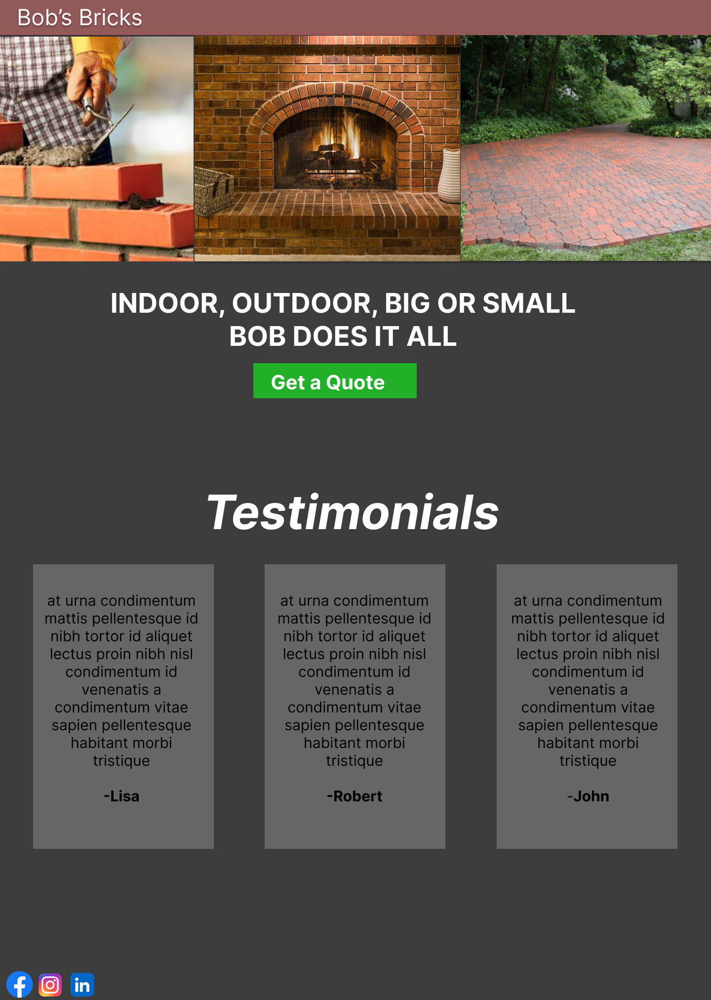
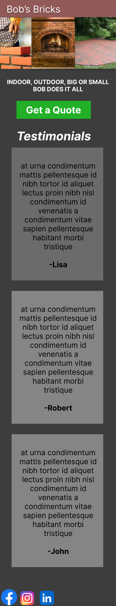

# Landing
Designed a simple Landing Page for a fictitious brick working company in Figma and then from that design I used html, CSS, and bootstrap 
to implement my design with responsiveness in mind.

## Designs

  # Desktop
  
  # Mobile
  

## Live Deployment
  https://jacobm2000.github.io/Landing/